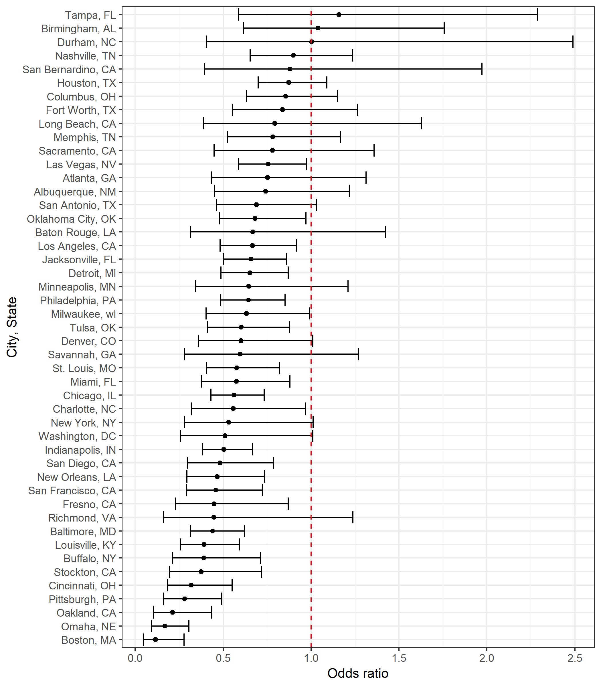

Data Science Homework 6
================

### Problem One

*importing and manipulating data*

``` r
murder <- 
  read_csv("https://raw.githubusercontent.com/washingtonpost/data-homicides/master/homicide-data.csv")

murder <- murder %>%  
  # doing some cleaning
  unite("city_state", c("city", "state"), sep = ", ") %>% 
  mutate(solved = ifelse(disposition == "Closed by arrest", 1, 0), 
         victim_race = ifelse(victim_race != "White", "non-White", "White"), 
         victim_race = fct_relevel(victim_race, "White", "non-White"),
         victim_age = as.numeric(victim_age)) %>% 
  filter(!(city_state %in% c("Dallas, TX", "Phoenix, AZ", "Kansas City, MO", "Tulsa, AL")))
```

*Logit models*

``` r
balt_model <- murder %>% 
  # running glm only on Baltimore
  filter(city_state == "Baltimore, MD") %>% 
  glm(solved ~ victim_sex + victim_race + victim_age, family = binomial, data = .)

# making a dandy table
broom::tidy(balt_model) %>% 
  mutate(or = exp(estimate), 
         or_lower = exp(estimate - 1.96*std.error), 
         or_upper = exp(estimate + 1.96*std.error)) %>% 
  filter(term == "victim_racenon-White") %>% 
  select(or, or_lower, or_upper) %>% 
  rename("Odds ratio" = or, 
         "Lower bound" = or_lower, 
         "Upper bound" = or_upper) %>% 
  knitr::kable(digits = 3)
```

|  Odds ratio|  Lower bound|  Upper bound|
|-----------:|------------:|------------:|
|       0.441|        0.313|         0.62|

In Baltimore, the odds of a non-White homicide victims case being solved is 0.441 times that of White victim (95% CI: 0.313, 0.62)

``` r
murder %>% 
  # first creating a listcolumn organized by city_state
  group_by(city_state) %>% 
  nest() %>% 
  # running glm on every city
  mutate(logit_solve = map(data, ~glm(solved ~ victim_sex + victim_race + victim_age, 
                                      family = binomial, data = .x)), 
         logit_solve = map(logit_solve, broom::tidy)) %>% 
  select(-data) %>% 
  unnest() %>% 
  # extracting the OR of interest
  filter(term == "victim_racenon-White") %>% 
  # calulating some ci's
  mutate(or = exp(estimate), 
         or_lower = exp(estimate - 1.96*std.error), 
         or_upper = exp(estimate + 1.96*std.error), 
         city_state = fct_reorder(city_state, estimate)) %>% 
  select(city_state, or, or_lower, or_upper) %>% 
  # making a nice plot
  ggplot(aes(x = city_state, y = or)) + 
  geom_point() + 
  geom_errorbar(aes(ymin = or_lower, ymax = or_upper)) + 
  # visualizing one
  geom_hline(yintercept = 1.0, linetype = "dashed", color = "red") + 
  coord_flip() + 
  labs(title = "OR's for solving non-White homicide compared \nto solving a White homicide in different cities", 
       y = "Odds ratio", 
       x = "City, State")
```



Boston has the lowest odds ratio of all the cities analyzed indicating that they are the least likely to solve a non-White homicide compared to how likely they are to solve a White homicide; Boston is followed by Omaha, Nebraska and Oakland, California. Most cities appear to trend in this direction. However, about half have confidence intervals that include one. Tampa, Florida and Birmingham, Alabama are the only two cities who have estimated odds ratios greater than one, indicating the odds of a non-White homicide being solved are greater than a White homicide being solved. However, both estimates have very wide confidence intervals and are thus non-significant. The width of the confidence intervals actually tells us some important information as well. The cities with narrow intervals are cities with a large amount of homicides while the cities with wide intervals have fewer.

### Problem Two

*importing and cleaning data*

``` r
bweight <- read_csv("data/birthweight.csv") %>% 
  janitor::clean_names()

# checking for missing data
# sum(is.na(bweight))
# equals 0, no missing data

# converting to factors
bweight <- bweight %>% 
  mutate(babysex = as.factor(babysex), 
         frace = as.factor(frace), 
         malform = as.factor(malform), 
         mrace = as.factor(mrace))
```

After loading the data, I first checked for missing values and found that there were none. I then converted the baby's sex, father's race, the indicator of a malformation, and mother's race to factors.

*Exploratory plots and analyses*

``` r
# visual peek at birthweight
dens <- bweight %>% 
  ggplot(aes(x = bwt)) + 
  geom_histogram()

box <- bweight %>% 
  ggplot(aes(y = bwt)) + 
  geom_boxplot()

wrap_elements(dens + box) + ggtitle("Histogram and boxplot of infant birthweight")
```


Looking at a histogram and boxplot of infant birth weight, birth weight appears to be normally distributed. However, there seem to be many outliers.

``` r
# dataset with only numeric variables
wt_num <- select_if(bweight, is.numeric)

# calculating correlation coefficients for the numeric variables and putting in a table
corr <- list()

for (i in 1:ncol(wt_num)) {
  corr[[i]] <- cor(wt_num$bwt, wt_num[i])
}

as.data.frame(corr) %>% 
  gather(key = var, value = correlation) %>% 
  filter(abs(correlation) > 0.2, 
         var != "bwt") %>% 
  knitr::kable(digits = 3)
```

| var     |  correlation|
|:--------|------------:|
| bhead   |        0.747|
| blength |        0.743|
| delwt   |        0.288|
| gaweeks |        0.412|
| wtgain  |        0.247|

``` r
# loops through scatter plots of variables with bwt, dont run
# make <- function(var) {
#   ggplot() + 
#     geom_point(aes_string(x = "var", y = wt_num$bwt)) 
# }
# 
# map(wt_num, make)
```

*Model building*

I chose a regression model based on a combination of hypothesized factors that influence birth weight as well as a data driven model building process. I first came up with 3 possible models: `hyp_mod`, `cor_mod`, and `comb_mod`. The hypothesis only model was based on variables that had more "clinical" significance (except baby sex which I included as a control variable); for example, the babies length and head circumference most likely influences the babies weight, however it is impossible to intervene and make the baby longer or have a larger head. As such, I chose family monthly income as an indicator of socioeconomic status, gestational age, the number of prior live births, the average number of cigarettes smoked during the pregnancy, and the amount of weight gained by the mother during the pregnancy. Obviously, there are other variables that could have been included in this model but I focused on limiting the number of predictors and being aware of possible collinearity issues. I also did not explore any interactions or non-linear models for reasons of interpretability.

The second model I tested was simply based on numeric predictors that had a correlation coefficient whose absolute value with birth weight was greater than 0.20. By no means is this a great way of selecting variables but this did give an indication of numeric variables that possibly have a linear relationship with birth weight. I also wanted to avoid something like step-wise selection while also not using a more advanced method like LASSO which would require using a package not discussed in class. These variables were circumference of the baby's head, the length of the baby, gestational age, mother weight gain, and mother's weight at delivery.

The last candidate model was a combination of the hypothesized model and the correlation based model.

``` r
set.seed(20)

# cross validating
cv_bweight <- crossv_mc(bweight, 100)

# running candidate models on training data in cv_bweight
cv_bweight <- cv_bweight %>% 
    mutate(hyp_mod = map(train, ~lm(bwt ~ babysex + fincome + gaweeks + parity + smoken + wtgain, data = .x)),
           cor_mod = map(train, ~lm(bwt ~ bhead + blength + gaweeks + wtgain + delwt, data = .x)), 
           comb_mod = map(train, ~lm(bwt ~ babysex + fincome + gaweeks + parity + smoken + wtgain + 
                                       bhead + blength + delwt, data = .x))) %>% 
    mutate(rmse_hyp = map2_dbl(hyp_mod, test, ~rmse(model = .x, data = .y)),
           rmse_cor = map2_dbl(cor_mod, test, ~rmse(model = .x, data = .y)),
           rmse_comb = map2_dbl(comb_mod, test, ~rmse(model = .x, data = .y)))

# plotting rmse of the candidate models on testing data
cv_bweight %>%  
  select(starts_with("rmse")) %>% 
  gather(key = model, value = rmse) %>% 
  mutate(model = str_replace(model, "rmse_", ""),
         model = fct_inorder(model)) %>% 
  ggplot(aes(x = model, y = rmse)) + 
  geom_violin() + 
  labs(title = "Violin plots of RMSE")
```


``` r
cv_bweight %>%  
  select(starts_with("rmse")) %>% 
  gather(key = model, value = rmse) %>% 
  mutate(model = str_replace(model, "rmse_", ""),
         model = fct_inorder(model)) %>% 
  group_by(model) %>% 
  summarize(avg_rmse = mean(rmse)) %>% 
  knitr::kable(digits = 3)
```

| model |  avg\_rmse|
|:------|----------:|
| hyp   |    447.904|
| cor   |    282.426|
| comb  |    279.478|

*Final model*

Based on the violin plots of the RMSE calculated using the testing set of data among the three models, I chose the combination model as my final model. It had the lowest average RMSE (279.48).

``` r
# creating model using all data
comb_mod <- bweight %>% 
  lm(bwt ~ babysex + fincome + gaweeks + parity + smoken + wtgain + bhead + blength, data = .) 

# plotting residuals and predicted values
bweight %>% 
  add_predictions(comb_mod) %>% 
  add_residuals(comb_mod) %>% 
  ggplot(aes(x = pred, y = resid)) + 
  geom_point() + 
  geom_smooth(se = FALSE) + 
  labs(title = "Predicted values vs. residuals plot for combination model")
```


The above scatter plot shows the relationship between predicted values and residuals for the final combination model. It appears that the model poorly predicts very low birth weights. It also appears the equality of variance assumption is not holding and that outliers/points with high influence are present.

*Comparing with other models*

``` r
cv_bweight2 <- crossv_mc(bweight, 100)

cv_bweight2 <- cv_bweight2 %>% 
  mutate(mine_mod = map(train, ~lm(bwt ~ babysex + fincome + gaweeks + parity + smoken + wtgain + 
                                       bhead + blength, data = .x)), 
         main_mod = map(train, ~lm(bwt ~ blength + gaweeks, data = .x)), 
         emm_mod = map(train, ~lm(bwt ~ (bhead + blength + babysex)^4, data = .x))) %>% 
  mutate(rmse_mine = map2_dbl(mine_mod, test, ~rmse(model = .x, data = .y)),
         rmse_main = map2_dbl(main_mod, test, ~rmse(model = .x, data = .y)),
         rmse_emm = map2_dbl(emm_mod, test, ~rmse(model = .x, data = .y)))

cv_bweight2 %>% 
  select(starts_with("rmse")) %>% 
  gather(key = model, value = rmse) %>% 
  mutate(model = str_replace(model, "rmse_", ""),
         model = fct_inorder(model)) %>% 
  ggplot(aes(x = model, y = rmse)) + 
  geom_violin() + 
  labs(title = "Violin plots of RMSE")
```


``` r
cv_bweight2 %>%  
  select(starts_with("rmse")) %>% 
  gather(key = model, value = rmse) %>% 
  mutate(model = str_replace(model, "rmse_", ""),
         model = fct_inorder(model)) %>% 
  group_by(model) %>% 
  summarize(avg_rmse = mean(rmse)) %>% 
  knitr::kable(digits = 3)
```

| model |  avg\_rmse|
|:------|----------:|
| mine  |    281.154|
| main  |    333.144|
| emm   |    288.990|

The above figure presents violin plots for the RMSE for my proposed model, the main effects model, and the interaction model. Based on these plots, I would still choose my model, however I might consider adding the interactions specified in the interaction model. It is important to note that I have not evaluated the significance of any of these models or used another measures like AIC in making a decision.
