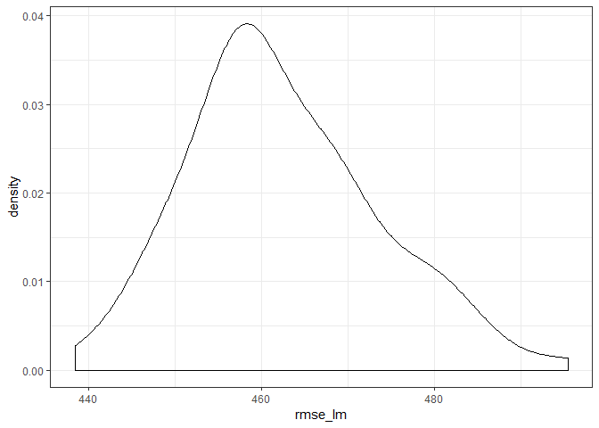

Data Science Homework 6
================

### Problem One

*importing and manipulating data*

``` r
murder <- 
  read_csv("https://raw.githubusercontent.com/washingtonpost/data-homicides/master/homicide-data.csv")

murder <- murder %>%  
  unite("city_state", c("city", "state"), sep = ", ") %>% 
  mutate(solved = ifelse(disposition == "Closed by arrest", 1, 0), 
         victim_race = ifelse(victim_race != "White", "non-White", "White"), 
         victim_race = fct_relevel(victim_race, "White", "non-White"),
         victim_age = as.numeric(victim_age)) %>% 
  filter(!(city_state %in% c("Dallas, TX", "Phoenix, AZ", "Kansas City, MO", "Tulsa, AL")))
```

*Logit models*

``` r
balt_model <- murder %>% 
  filter(city_state == "Baltimore, MD") %>% 
  glm(solved ~ victim_sex + victim_race + victim_age, family = binomial, data = .)

broom::tidy(balt_model) %>% 
  mutate(or = exp(estimate), 
         or_lower = exp(estimate - 1.96*std.error), 
         or_upper = exp(estimate + 1.96*std.error)) %>% 
  filter(term == "victim_racenon-White") %>% 
  select(or, or_lower, or_upper) %>% 
  rename("Odds ratio" = or, 
         "Lower bound" = or_lower, 
         "Upper bound" = or_upper) %>% 
  knitr::kable(digits = 3)
```

|  Odds ratio|  Lower bound|  Upper bound|
|-----------:|------------:|------------:|
|       0.441|        0.313|         0.62|

``` r
murder %>% 
  group_by(city_state) %>% 
  nest() %>% 
  mutate(logit_solve = map(data, ~glm(solved ~ victim_sex + victim_race + victim_age, 
                                      family = binomial, data = .x)), 
         logit_solve = map(logit_solve, broom::tidy)) %>% 
  select(-data) %>% 
  unnest() %>% 
  filter(term == "victim_racenon-White") %>% 
  mutate(or = exp(estimate), 
         or_lower = exp(estimate - 1.96*std.error), 
         or_upper = exp(estimate + 1.96*std.error), 
         city_state = fct_reorder(city_state, estimate)) %>% 
  select(city_state, or, or_lower, or_upper) %>% 
  ggplot(aes(x = city_state, y = or)) + 
  geom_point() + 
  geom_errorbar(aes(ymin = or_lower, ymax = or_upper)) + 
  geom_hline(yintercept = 1.0, linetype = "dashed") + 
  coord_flip() + 
  labs(y = "Odds ratio", 
       x = "City, State")
```


### Problem Two

``` r
bweight <- read_csv("data/birthweight.csv") %>% 
  janitor::clean_names()

# sum(is.na(bweight))
# equals 0, no missing data

corr <- list()

for (i in 1:ncol(bweight)) {
  corr[[i]] <- cor(bweight$bwt, bweight[i])
}
```

    ## Warning in cor(bweight$bwt, bweight[i]): the standard deviation is zero

    ## Warning in cor(bweight$bwt, bweight[i]): the standard deviation is zero

``` r
as.data.frame(corr) %>% 
  gather(key = var, value = correlation) %>% 
  filter(correlation > 0.2)
```

    ##       var correlation
    ## 1   bhead   0.7471068
    ## 2 blength   0.7434508
    ## 3     bwt   1.0000000
    ## 4   delwt   0.2878893
    ## 5 gaweeks   0.4121833
    ## 6  wtgain   0.2472526

``` r
lm_mod <- bweight %>% 
  lm(bwt ~ bhead + blength + delwt + gaweeks + wtgain + mrace + frace + malform + babysex + menarche + smoken, data = .)

# adding menarche because I think this is what the low values are associated with

rmse(lm_mod, bweight)
```

    ## [1] 276.4477

``` r
bweight %>% 
  add_predictions(model = lm_mod) %>% 
  add_residuals(model = lm_mod) %>% 
  ggplot(aes(x = pred, y = resid)) + 
  geom_point() + 
  geom_smooth(se = FALSE)
```


``` r
cor(bweight$bwt, bweight$gaweeks)
```

    ## [1] 0.4121833

``` r
bweight <- bweight %>% 
  mutate(babysex = as.factor(babysex), 
         frace = as.factor(frace), 
         malform = as.factor(malform), 
         mrace = as.factor(mrace))
```

``` r
cv_bweight <- crossv_mc(bweight, 100)

# checking if any variables I don't think will be main predictors are signficant amongst themselves

cv_bweight %>% 
  mutate(lm_mod = map(train, ~lm(bwt ~ delwt + frace + menarche + mheight + momage + parity + wtgain, 
                                 data = .x)), 
         lm_mod = map(lm_mod, broom::tidy)) %>% 
  select(.id, lm_mod) %>% 
  unnest() %>% 
  group_by(term) %>% 
  summarize(avg_p = mean(p.value)) %>% 
  filter(avg_p < 0.05)
```

    ## # A tibble: 6 x 2
    ##   term           avg_p
    ##   <chr>          <dbl>
    ## 1 (Intercept) 5.36e-10
    ## 2 delwt       1.31e-18
    ## 3 frace2      1.64e-56
    ## 4 frace4      4.41e- 3
    ## 5 mheight     4.65e- 6
    ## 6 wtgain      1.37e-19

``` r
bweight %>% 
  lm(bwt ~ babysex + bhead + blength + delwt + fincome + frace + gaweeks + malform +
                                   mheight + mrace + parity + pnumlbw + ppbmi + ppwt + smoken + wtgain, data = .) %>% 

mods <- cv_bweight %>% 
  mutate(lm_mod = map(train, ~lm(bwt ~ babysex + gaweeks + malform + smoken, 
                                 data = .x))) %>% 
  mutate(pred = map2(test, lm_mod, add_predictions))
```

    ## Error in bweight %>% lm(bwt ~ babysex + bhead + blength + delwt + fincome + : could not find function "%>%<-"

``` r
  select(.id)
```

    ## Error in select(.id): object '.id' not found

``` r
cv_bweight <- cv_bweight %>% 
  mutate(lm_mod = map(train, ~lm(bwt ~ babysex + gaweeks + malform + smoken, 
                                 data = .x))) %>% 
  mutate(rmse_lm = map2_dbl(lm_mod, test, ~rmse(model = .x, data = .y)))

cv_bweight %>% 
  select(rmse_lm) %>% 
  gather(key = .id, value = rmse_lm) %>% 
  ggplot(aes(rmse_lm)) + 
  geom_density()
```



``` r
pred <- map2(mods$test, mods$lm_mod, add_predictions)
```

    ## Error in map2(mods$test, mods$lm_mod, add_predictions): object 'mods' not found

``` r
choose <- c("delweight", "frace", "menarche", "mheight", "momage", "parity", "wtgain")

pmodels <- list()

varlist <- tibble(
  x = 1:7
)

take <- function(i) {
  as.tibble(combn(choose, i))
}

varlist <- varlist %>% 
  group_by(x) %>% 
  nest() %>% 
  mutate(vars = map(x, take))
```
