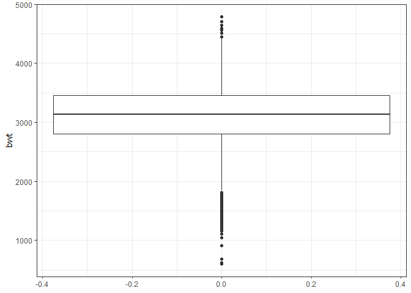

Data Science Homework 6
================

### Problem One

*importing and manipulating data*

``` r
murder <- 
  read_csv("https://raw.githubusercontent.com/washingtonpost/data-homicides/master/homicide-data.csv")

murder <- murder %>%  
  unite("city_state", c("city", "state"), sep = ", ") %>% 
  mutate(solved = ifelse(disposition == "Closed by arrest", 1, 0), 
         victim_race = ifelse(victim_race != "White", "non-White", "White"), 
         victim_race = fct_relevel(victim_race, "White", "non-White"),
         victim_age = as.numeric(victim_age)) %>% 
  filter(!(city_state %in% c("Dallas, TX", "Phoenix, AZ", "Kansas City, MO", "Tulsa, AL")))
```

*Logit models*

``` r
balt_model <- murder %>% 
  filter(city_state == "Baltimore, MD") %>% 
  glm(solved ~ victim_sex + victim_race + victim_age, family = binomial, data = .)

broom::tidy(balt_model) %>% 
  mutate(or = exp(estimate), 
         or_lower = exp(estimate - 1.96*std.error), 
         or_upper = exp(estimate + 1.96*std.error)) %>% 
  filter(term == "victim_racenon-White") %>% 
  select(or, or_lower, or_upper) %>% 
  rename("Odds ratio" = or, 
         "Lower bound" = or_lower, 
         "Upper bound" = or_upper) %>% 
  knitr::kable(digits = 3)
```

|  Odds ratio|  Lower bound|  Upper bound|
|-----------:|------------:|------------:|
|       0.441|        0.313|         0.62|

``` r
murder %>% 
  group_by(city_state) %>% 
  nest() %>% 
  mutate(logit_solve = map(data, ~glm(solved ~ victim_sex + victim_race + victim_age, 
                                      family = binomial, data = .x)), 
         logit_solve = map(logit_solve, broom::tidy)) %>% 
  select(-data) %>% 
  unnest() %>% 
  filter(term == "victim_racenon-White") %>% 
  mutate(or = exp(estimate), 
         or_lower = exp(estimate - 1.96*std.error), 
         or_upper = exp(estimate + 1.96*std.error), 
         city_state = fct_reorder(city_state, estimate)) %>% 
  select(city_state, or, or_lower, or_upper) %>% 
  ggplot(aes(x = city_state, y = or)) + 
  geom_point() + 
  geom_errorbar(aes(ymin = or_lower, ymax = or_upper)) + 
  geom_hline(yintercept = 1.0, linetype = "dashed", color = "red") + 
  coord_flip() + 
  labs(y = "Odds ratio", 
       x = "City, State")
```


### Problem Two

``` r
bweight <- read_csv("data/birthweight.csv") %>% 
  janitor::clean_names()

# sum(is.na(bweight))
# equals 0, no missing data

bweight <- bweight %>% 
  mutate(babysex = as.factor(babysex), 
         frace = as.factor(frace), 
         malform = as.factor(malform), 
         mrace = as.factor(mrace))

# dataset with only numeric variables
wt_num <- select_if(bweight, is.numeric)

corr <- list()

for (i in 1:ncol(wt_num)) {
  corr[[i]] <- cor(wt_num$bwt, wt_num[i])
}

as.data.frame(corr) %>% 
  gather(key = var, value = correlation) %>% 
  filter(abs(correlation) > 0.2) %>% 
  knitr::kable()
```

| var     |  correlation|
|:--------|------------:|
| bhead   |    0.7471068|
| blength |    0.7434508|
| bwt     |    1.0000000|
| delwt   |    0.2878893|
| gaweeks |    0.4121833|
| wtgain  |    0.2472526|

``` r
bweight %>% 
  ggplot(aes(x = bwt)) + 
  geom_density()
```


``` r
bweight %>% 
  ggplot(aes(y = bwt)) + 
  geom_boxplot()
```



I chose a regression model based on a combination of hypothesized factors that influence birth weight as well as a data driven model building process. I first came up with 3 possible models: `hyp_mod`, `cor_mod`, and `comb_mod`. The hypothesis only model was based on variables that were more related to the mother than the baby (except baby sex which I included as a control variable); as such, I chose family monthly income as an indicator of socioeconomic status, gestational age, the number of prior live births, the average number of cigarretes smoked during the pregnancy, and the amount of weight gained by the mother during the pregnancy. Obviously, there are other variables that could have been included this model but I focused on limiting the number of predictors and being aware of possible collinearity issues.

The second model I tested was simply based on numeric predictors that had a correlation coefficient whose absolute value with birthweight was greater than 0.20. By no means, is this a great way of selecting variables but this did give an indication of numeric variables that possibly have a linear relationship with birthweight. I also wanted to avoid something like stepwise selection while also not using a more advanced method like LASSO for which would require using a package not discussed in class. These variables were circumference of the baby's head, the length of the baby, gestational age, mother weight gain, and mother's weight at delivery.

The last candidate model was a combination of the hypothesized model and the correlation based model.

``` r
set.seed(20)

cv_bweight <- crossv_mc(bweight, 100)

cv_bweight <- cv_bweight %>% 
    mutate(hyp_mod = map(train, ~lm(bwt ~ babysex + fincome + gaweeks + parity + smoken + wtgain, data = .x)),
           cor_mod = map(train, ~lm(bwt ~ bhead + blength + gaweeks + wtgain + delwt, data = .x)), 
           comb_mod = map(train, ~lm(bwt ~ babysex + fincome + gaweeks + parity + smoken + wtgain + 
                                       bhead + blength + delwt, data = .x))) %>% 
    mutate(rmse_hyp = map2_dbl(hyp_mod, test, ~rmse(model = .x, data = .y)),
           rmse_cor = map2_dbl(cor_mod, test, ~rmse(model = .x, data = .y)),
           rmse_comb = map2_dbl(comb_mod, test, ~rmse(model = .x, data = .y)))

cv_bweight %>%  
  select(starts_with("rmse")) %>% 
  gather(key = model, value = rmse) %>% 
  mutate(model = str_replace(model, "rmse_", ""),
         model = fct_inorder(model)) %>% 
  ggplot(aes(x = model, y = rmse)) + 
  geom_violin()
```


Based on the violin plots of the RMSE calculated using the testing set of data among the three models, I chose the combination model as my final model.

``` r
comb_mod <- bweight %>% 
  lm(bwt ~ babysex + fincome + gaweeks + parity + smoken + wtgain + bhead + blength, data = .) 

bweight %>% 
  add_predictions(comb_mod) %>% 
  add_residuals(comb_mod) %>% 
  ggplot(aes(x = pred, y = resid)) + 
  geom_point() + 
  geom_smooth(se = FALSE)
```


The above scatter plot shows the relationship between predicted values and residuals for the final combination model. It appears that the model poorly predicts very low birthweights. It also appears the equality of variance assumption is not holding and that outliers/points with high influence are present.

``` r
cv_bweight2 <- crossv_mc(bweight, 100)

cv_bweight2 <- cv_bweight2 %>% 
  mutate(my_mod = map(train, ~lm(bwt ~ babysex + fincome + gaweeks + parity + smoken + wtgain + 
                                       bhead + blength, data = .x)), 
         main_mod = map(train, ~lm(bwt ~ blength + gaweeks, data = .x)), 
         emm_mod = map(train, ~lm(bwt ~ (bhead + blength + babysex)^4, data = .x))) %>% 
  mutate(rmse_my = map2_dbl(my_mod, test, ~rmse(model = .x, data = .y)),
         rmse_main = map2_dbl(main_mod, test, ~rmse(model = .x, data = .y)),
         rmse_emm = map2_dbl(emm_mod, test, ~rmse(model = .x, data = .y)))

cv_bweight2 %>% 
  select(starts_with("rmse")) %>% 
  gather(key = model, value = rmse) %>% 
  mutate(model = str_replace(model, "rmse_", ""),
         model = fct_inorder(model)) %>% 
  ggplot(aes(x = model, y = rmse)) + 
  geom_violin()
```


